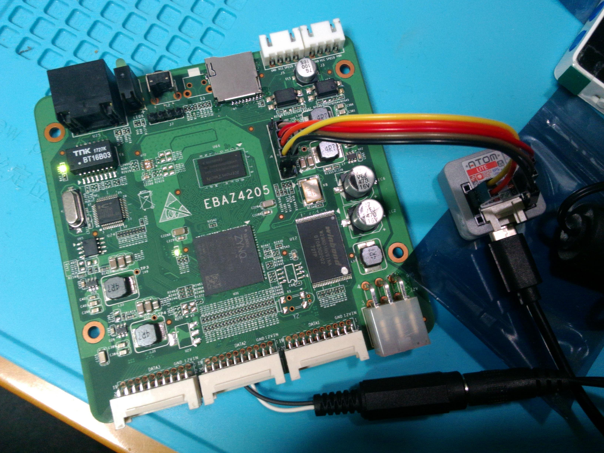
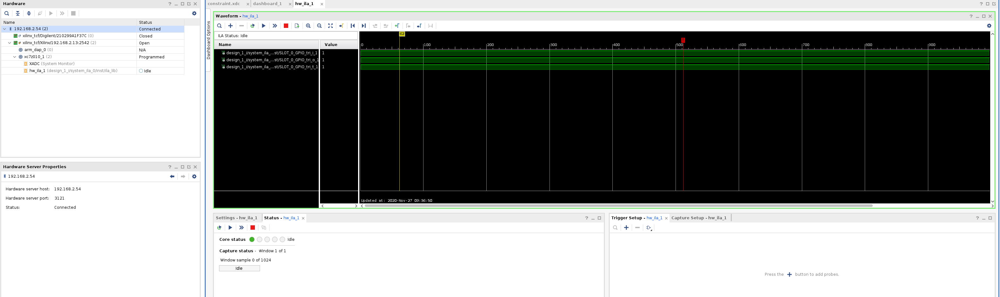
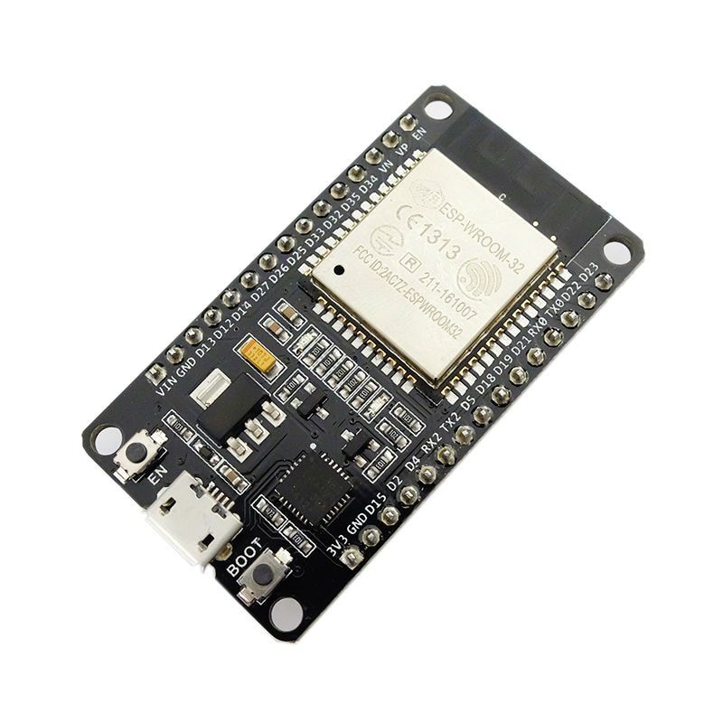

# Xilinx Virtual Cable Server for ESP32

 

## Overview
[Xilinx Virtual Cable](https://github.com/Xilinx/XilinxVirtualCable/) (XVC) is a TCP/IP-based protocol that  acts like a JTAG cable and provides a means to access and debug your  FPGA or SoC design without using a physical cable.
A full description of Xilinx Virtual Cable in action is provided in the [XAPP1252 application note](https://www.xilinx.com/support/documentation/application_notes/xapp1251-xvc-zynq-petalinux.pdf).

This is an implementation of the "XVC - Xilinx Virtual Cable" protocol for 
writing from ESP32 to Xilinx FPGAs.

By connecting the ESP32 to the JTAG pins (TDI, TDO, TMS, TCK) of the target
FPGA, you can access the JTAG port of the FPGA from a Xilinx tool (Vivado,
etc.) via WiFi.

This project is compiled based on ESP-IDF version 4.4 and you can see all supported chips in the table below.

|Chip         |            State           |
|:----------- |:-------------------------: |
|ESP32        | ![alt text][supported]     |
|ESP32-S2     | ![alt text][supported]     |
|ESP32-S3     | ![alt text][Need-Verified] |
|ESP32-C3     | ![alt text][Need-Verified] |
|ESP32-C2     | ![alt text][Unsupported]   |
|ESP32-H2     | ![alt text][Unsupported]   |

[Supported]: https://img.shields.io/badge/-Supported-lightgreen?style=flat-square "Supported"
[Need-Verified]: https://img.shields.io/badge/-Need--Verified-yellow?style=flat-square "Need-Verified"
[Unsupported]: https://img.shields.io/badge/-Unsupported-red?style=flat-square "Unsupported"

The above is just a list of the core chips supported, you can also develop with other hardware based on these chips.

In this example photo, the M5Stack ESP32 module [M5Atom Lite](https://docs.m5stack.com/#/en/core/atom_lite) is connected to a Zynq XC7Z010 FPGA (on EBAZ4205 'Development' Board).



In this state, if you add and connect as a Virtual Cable from Vivado Hardware Manager with `Add Virtual Cable`, you can observe the waveform of ILA in the same way as a normal JTAG adapter.



## How to use

First you need to set up the compilation environment, please refer to [Getting Started with VS Code IDE](https://docs.espressif.com/projects/esp-idf/en/latest/esp32/get-started/vscode-setup.html)

Note: The default pin mappings for the common, low-cost `ESP32 WROOM DevKit v1`
development board are:

```
TDI = D25, TDO = D21, TCK = D19, TMS = D22
```

Feel free to experiment with different ESP32 development boards - most should
just work with any problems.



| ESP32 Dev Board | JTAG |
|-----------------|------|
| 25 (D25)        | TDI  |
| 21 (D21)        | TDO  |
| 19 (D19)        | TCK  |
| 22 (D22)        | TMS  |

Finally, build the program using Arduino IDE and write it to the ESP32 board.

#### Rough Performance Stats ("Speed")

Writing a small bitstream (Blinky with `PS7 IP` + Ethernet stuff) sized around
400 KiB using Vivado 2021.1 takes around 10 seconds.

Kenta-San's version may offer faster performance, perhaps at the cost of
losing some portability across different ESP32 boards.

### Tips

If you see the `End of startup status: LOW` error message in Vivado, check the
FPGA power supply's voltage and current ratings.

If cost and ease-of-availability are the driving constraints (at the cost of
speed), then this project can suffice. If higher programming speed is a
requirement, I recommend using `xc3sprog` with an FT2232H board.

### Related Ideas / Projects

- https://github.com/kholia/xvcpi
- https://github.com/kholia/xvc-pico
- https://github.com/kholia/xvc-esp8266
- https://github.com/kholia/Colorlight-5A-75B
- https://github.com/fusesoc/blinky#ebaz4205-development-board

## History

Main Author: Kenta IDA (https://github.com/ciniml)

Author 2: Dhiru Kholia (remove gpio optimizations, fix `jtag_xfer` function to mimic `xvcpi`, fix portability problems)

Author 3: Markus Xu (Porting to ESP-IDF compiled environment)

Upstream URL: https://github.com/ciniml/xvc-esp32

This is a port of Derek Mulcahy's XVC implementation for Raspberry Pi
(https://github.com/derekmulcahy/xvcpi) to ESP32.

## License
  

CC0 1.0 Universal (CC0 1.0) - Public Domain Dedication

https://creativecommons.org/publicdomain/zero/1.0/

Note: See `README-Original.md` for full licensing information.
